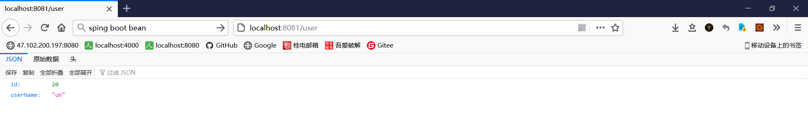
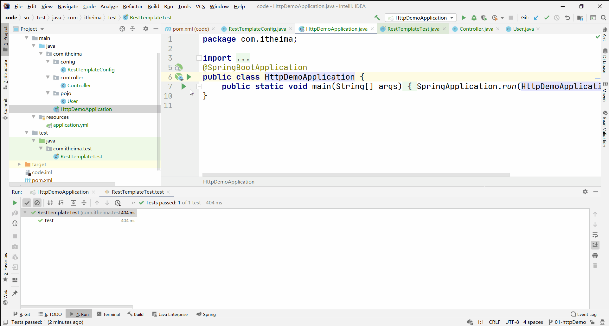

# Spring 的 RestTemplate

既然微服务选择了Http，那么我们就需要考虑自己来实现对请求和响应的处理。开源世界已经有很多的http客户端工具，能够帮助我们做这些事情，例如：HttpClient、OKHttp、URLConnection 。不过这些不同的客户端，API各不相同。而Spring也有对http的客户端进行封装，提供了工具类叫RestTemplate 。RestTemplate模对基于Http的客户端进行了封装，并且实现了对象与json的序列化和反序列化。

## 步骤

### 创建响应 User 对象的springboot 项目

#### 新建 maven 工程

工程名为 code，一路 next 即可

#### 导坐标

只是创建响应 User 对象的 springboot 项目用不到所有坐标，但为了省去多次导坐标的麻烦，这里就把本项目所需坐标全部导入：

> code\pom.xml

#### 编写入口程序

> code\src\main\java\com\itheima\HttpDemoApplication.java

#### 编写 User 类

> code\src\main\java\com\itheima\pojo\User.java

#### 编写 application.yml

这里设置端口为 8081，可能是我运行着其他东西吧，运行时端口冲突了，在这里端口设为 8081 避免冲突，还冲突就再改

> code\src\main\resources\application.yml

#### 编写 Controller

> code\src\main\java\com\itheima\controller\Controller.java

#### 测试是否响应 User 对象

启动 `HttpDemoApplication` 后访问：http://localhost:8081/user ，可见 `id` 和 `userName` ：

### 编写测试类

#### 装配 RestTemplate 的 Bean 对象

> code\src\main\java\com\itheima\config\RestTemplateConfig.java

#### 编写 RestTemplateTest

> code\src\test\java\com\itheima\test\RestTemplateTest.java

## 最终效果

先运行 `HttpDemoApplication` ，再运行 `RestTemplateTest.test()` ，可见控制台输出了 `User` 对象。

