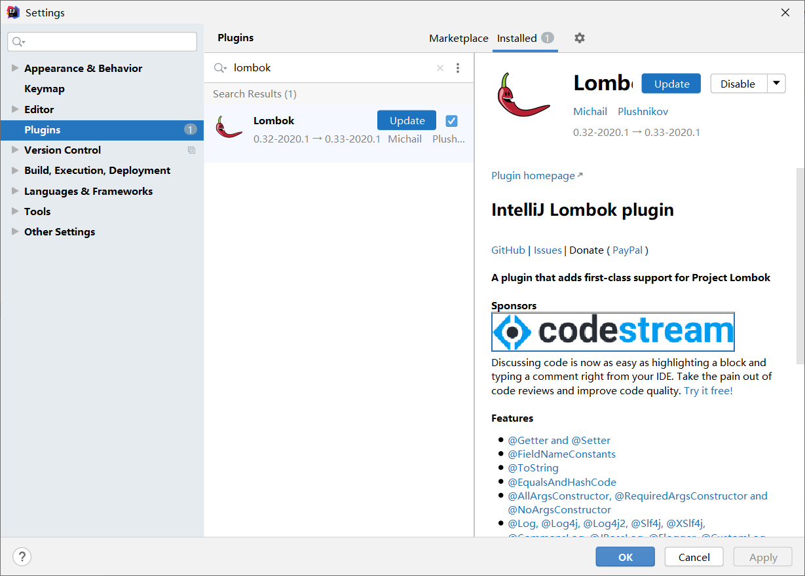
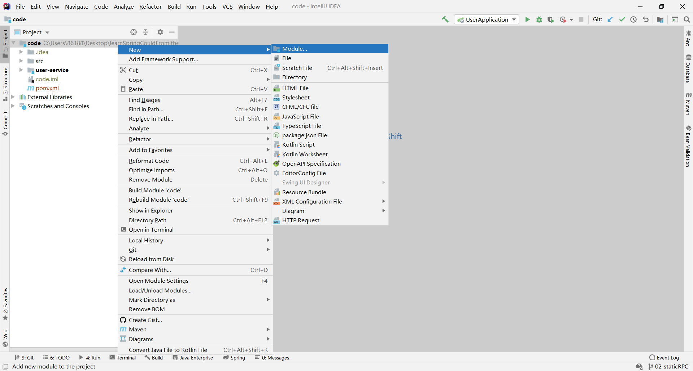
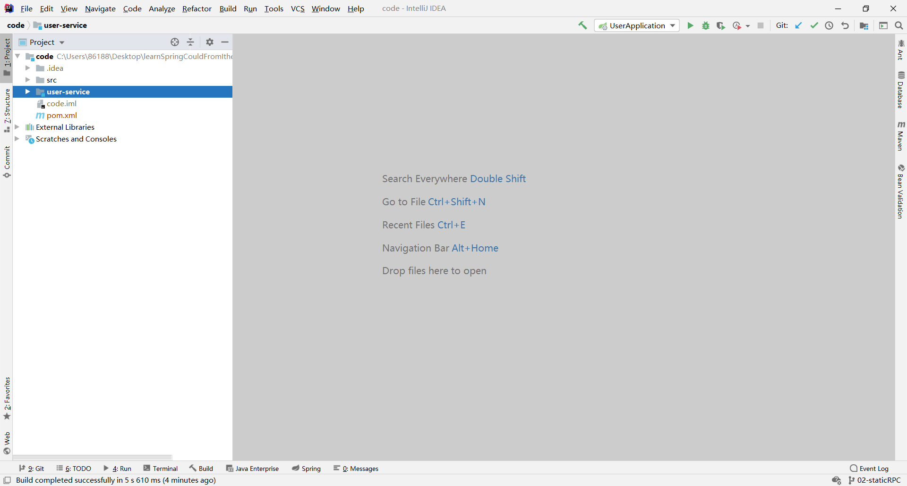
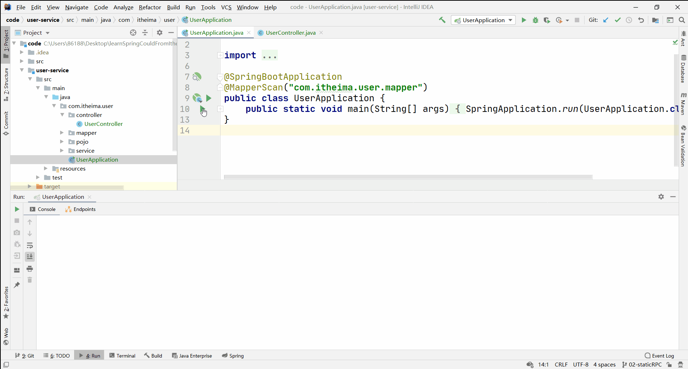

# 环境准备

## 创建数据库

```mysql
Create Database If Not Exists springcloud Character Set UTF8;
USE springcloud;

-- ----------------------------
-- Table structure for tb_user
-- ----------------------------
DROP TABLE IF EXISTS `tb_user`;
CREATE TABLE `tb_user` (
  `id` bigint(20) NOT NULL AUTO_INCREMENT,
  `user_name` varchar(100) DEFAULT NULL COMMENT '用户名',
  `password` varchar(100) DEFAULT NULL COMMENT '密码',
  `name` varchar(100) DEFAULT NULL COMMENT '姓名',
  `age` int(10) DEFAULT NULL COMMENT '年龄',
  `sex` tinyint(1) DEFAULT NULL COMMENT '性别，1男性，2女性',
  `birthday` date DEFAULT NULL COMMENT '出生日期',
  `note` varchar(255) DEFAULT NULL COMMENT '备注',
  `created` datetime DEFAULT NULL COMMENT '创建时间',
  `updated` datetime DEFAULT NULL COMMENT '更新时间',
  PRIMARY KEY (`id`),
  UNIQUE KEY `username` (`user_name`)
) ENGINE=InnoDB AUTO_INCREMENT=13 DEFAULT CHARSET=utf8;

-- ----------------------------
-- Records of tb_user
-- ----------------------------
INSERT INTO `tb_user` VALUES ('1', 'zhangsan', '123456', '张三', '30', '1', '1964-08-08', '张三同学在学Java', '2014-09-19 16:56:04', '2014-09-21 11:24:59');
INSERT INTO `tb_user` VALUES ('2', 'lisi', '123456', '李四', '21', '2', '1995-01-01', '李四同学在传智学Java', '2014-09-19 16:56:04', '2014-09-19 16:56:04');
INSERT INTO `tb_user` VALUES ('3', 'wangwu', '123456', '王五', '22', '2', '1994-01-01', '王五同学在学php', '2014-09-19 16:56:04', '2014-09-19 16:56:04');
INSERT INTO `tb_user` VALUES ('4', 'zhangliu', '123456', '张六', '20', '1', '1996-09-01', '张六同学在传智播客学Java', '2014-09-19 16:56:04', '2014-09-19 16:56:04');
INSERT INTO `tb_user` VALUES ('5', 'lina', '123456', '李娜', '28', '1', '1988-01-01', '李娜同学在传智播客学Java', '2014-09-19 16:56:04', '2014-09-19 16:56:04');
INSERT INTO `tb_user` VALUES ('6', 'lilei', '123456', '李雷', '23', '1', '1993-08-08', '李雷同学在传智播客学Java', '2014-09-20 11:41:15', '2014-09-20 11:41:15');
INSERT INTO `tb_user` VALUES ('7', 'hanmeimei', '123456', '韩梅梅', '24', '2', '1992-08-08', '韩梅梅同学在传智播客学php', '2014-09-20 11:41:15', '2014-09-20 11:41:15');
INSERT INTO `tb_user` VALUES ('8', 'itcast', '123456', '传智播客', '21', '2', '2008-07-08', '传智播客搞IT教育', '2014-09-20 11:41:15', '2014-09-20 11:41:15');
INSERT INTO `tb_user` VALUES ('9', 'heima', '123456', '黑马', '18', '2', '2012-08-08', '黑马是传智播客高端品牌', '2014-09-20 11:41:15', '2014-09-20 11:41:15');
INSERT INTO `tb_user` VALUES ('10', 'linus', '123456', '林纳斯', '45', '2', '1971-08-08', '林纳斯搞了linux又搞git', '2014-09-20 11:41:15', '2014-09-20 11:41:15');
INSERT INTO `tb_user` VALUES ('11', 'leijun', '123456', '雷布斯', '33', '2', '1983-08-08', '小爱同学；are you ok', '2014-09-20 11:41:15', '2014-09-20 11:41:15');
INSERT INTO `tb_user` VALUES ('12', 'madaye', '123456', '马大爷', '46', '2', '1980-08-08', '马大爷花呗可以不还吗', '2014-09-2 11:41:15', '2014-09-20 11:41:15');
```

## 准备 lombok



# 创建父工程

## 创建一个 maven 工程

## 导包

> code\pom.xml

# 创建user-service

## 创建方法

注意：子模块要在父工程的下级目录





## 添加依赖

> code\user-service\pom.xml

## 编写配置文件

> code\user-service\src\main\resources\application.yml

## 编写代码

> code\user-service\src\main\java\com\itheima\user\controller\UserController.java
> code\user-service\src\main\java\com\itheima\user\mapper\UserMapper.java
> code\user-service\src\main\java\com\itheima\user\pojo\User.java
> code\user-service\src\main\java\com\itheima\user\service\UserService.java
> code\user-service\src\main\java\com\itheima\user\UserApplication.java

## 启动并测试

启动 `user-service` 项目，访问接口：http://localhost:9091/user/8



# 创建 consumer-demo

## 创建方法

同上

## 添加依赖

> code\consumer-demo\pom.xml

## 编写代码

> code\consumer-demo\src\main\java\com\itheima\consumer\ConsumerApplication.java
> code\consumer-demo\src\main\java\com\itheima\consumer\pojo\User.java
> code\consumer-demo\src\main\java\com\itheima\consumer\controller\ConsumerController.java

## 启动并测试

启动 `user-service` 、`consumer-demo`，访问接口：http://localhost:8080/consumer/8

